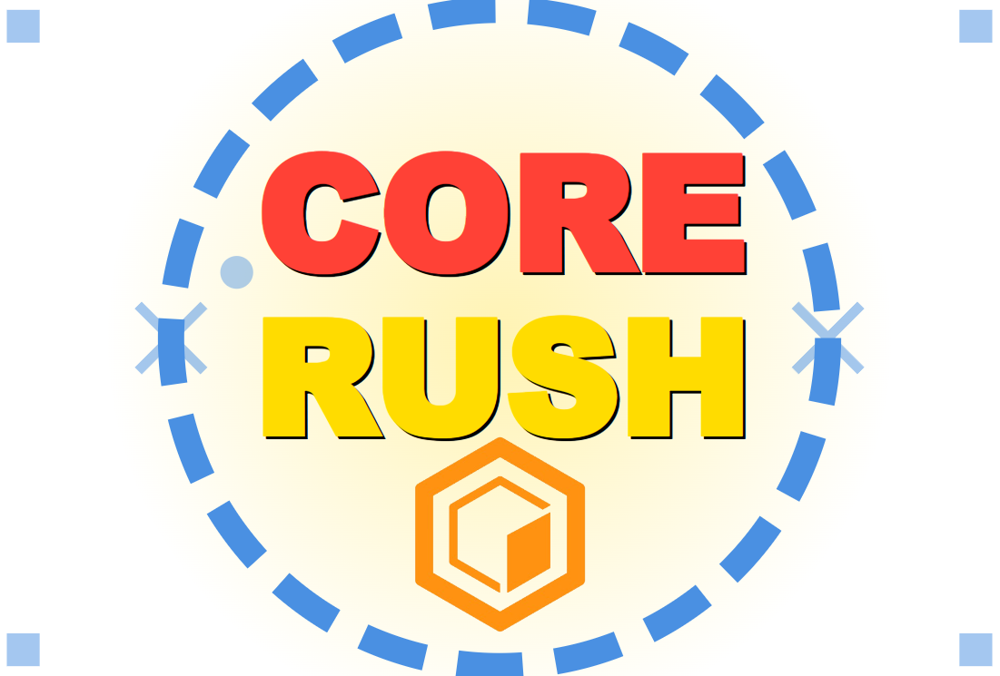
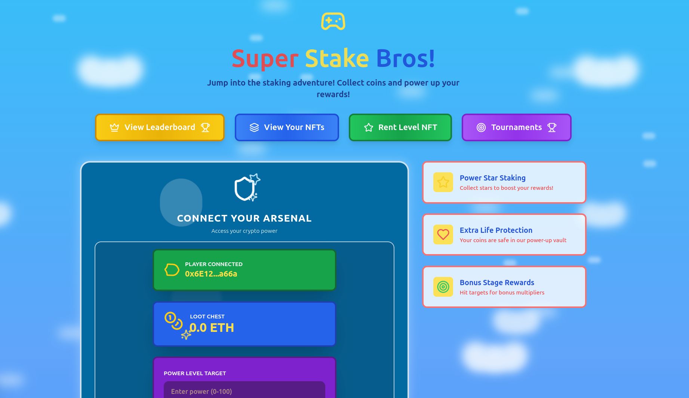
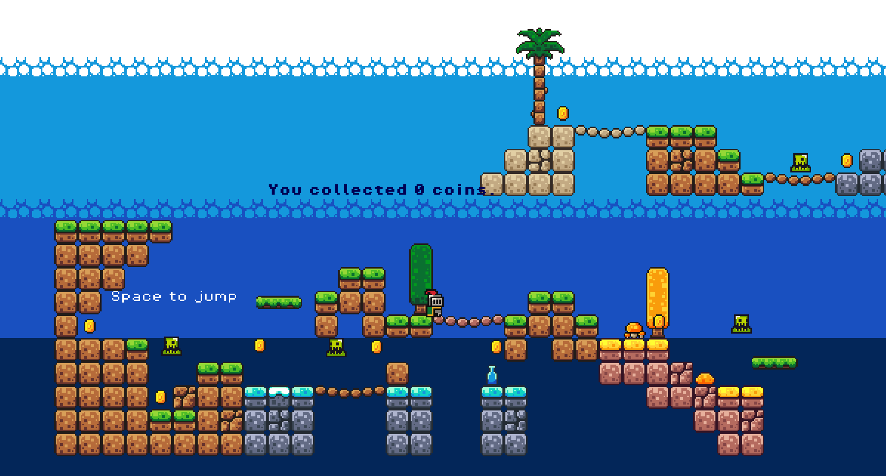
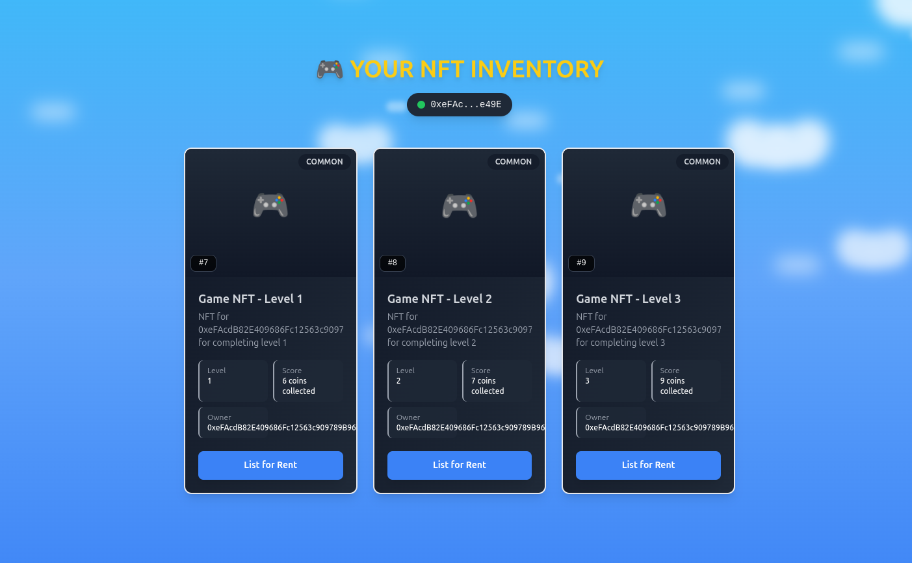
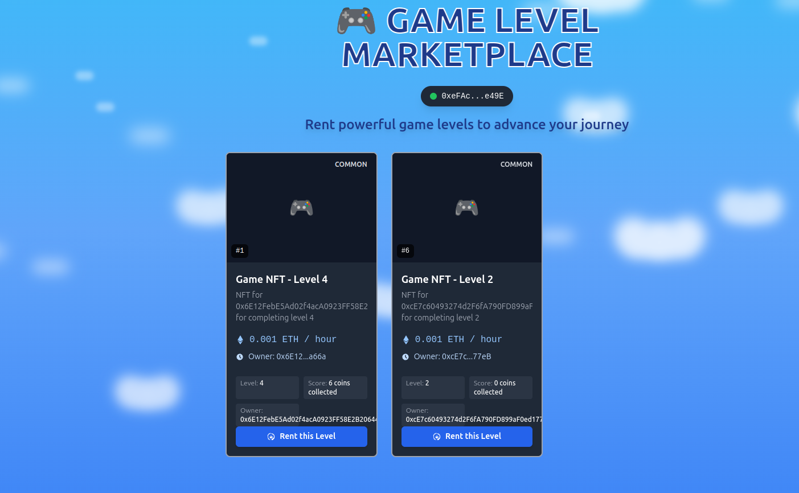
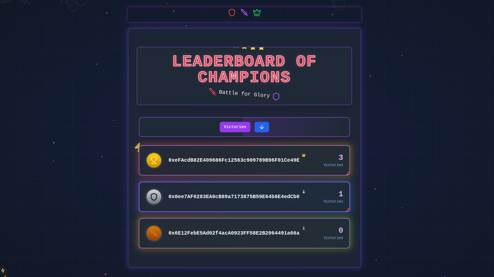

# CORErush - A Super Stake Bros Game

## Introduction
Welcome to **CORErush**, an exciting Mario-style game where players can stake their **CORE tokens**, predict their expected score, and win bonuses based on their performance. Test your skills, challenge yourself, and earn rewards by achieving your predicted score!

## How It Works
1. **Stake CORE Tokens**: Players must stake a certain amount of **CORE tokens** before starting the game.
2. **Set an Expected Score**: Players enter their target score before playing.
3. **Play the Game**: Navigate through levels, overcome obstacles, and score points.
4. **Bonus Calculation**: If the player meets or exceeds their expected score, the algorithm calculates a bonus based on their performance.
5. **Claim Rewards**: Players can claim their winnings if they successfully achieve their target score.

## Features

- **Classic Mario-style gameplay** with exciting levels and challenges.
- **Staking mechanism** using CORE tokens for risk-based gaming.
- **Algorithm-driven rewards** based on score predictions.
- **Decentralized & Transparent** system ensuring fair play.
- **Engaging and Competitive** gaming experience.

## Rules
- Players must **stake tokens** before starting a game session.
- The **expected score must be set** before playing.
- Players **only win bonuses** if they meet or exceed their expected score.
- If the player fails to achieve their expected score, the staked tokens remain in the system.
- Bonuses are dynamically calculated based on risk and performance.

## How to Play
1. **Attach Core Chain to MetaMask**  
   - Visit [Chainlist.org](https://chainlist.org) and search for "Core Chain".  
   - Connect your MetaMask wallet and add the network.  

2. **Connect your CORE wallet** to the game.  

3. **Stake your desired amount of CORE tokens**.  

4. **Enter your expected score**.  

5. **Start playing and aim to meet or exceed your target**.  

6. **Claim your rewards if you achieve your goal!**  

## Bonus Calculation
The bonus is calculated dynamically based on:
- The **difficulty level** of the game.
- The **staked amount** of CORE tokens.
- The **gap between the expected score and the actual score**.
- A **randomized multiplier** to keep gameplay exciting.
  
## NFT Rewards  
- On winning, an **NFT is mined for that level** and transferred to your wallet.  
- This NFT serves as proof that you have cleared the level.  
- It can be used for **future endeavors** in the game, unlocking exclusive tournaments

## Renting Your Earned NFT  
Once you earn an NFT by clearing a level, you have the option to **list it for rent**:  

### How to List Your NFT for Rent  
1. Navigate to the **Your NFTs** section in the game.  
2. Select the **NFT** you want to rent out.  
3. Set the **rental price** in CORE tokens.  
4. Confirm the listing, and your NFT will be available for other players to rent.  

### Earning CORE Tokens from Rentals  
- When another player rents your NFT, you **receive CORE tokens** as payment.  
- The NFT will remain in their possession for the rental period.  
- Once the rental expires, the NFT returns to you automatically.  

### Important Rule:  
- **If you rent out your NFT, you will need to clear that level again** before progressing further in the game.  

## Game Level Marketplace - Buy NFTs  
Purchase powerful game level NFTs to advance your progress in the game!  

### How to Buy  
1. Browse the available **Game Level NFTs** in the marketplace.  
2. Select an NFT corresponding to the level you want to unlock.  
3. Click on **Buy this NFT** and confirm the transaction.  
4. Once purchased, the NFT will be transferred to your wallet.  
5. You can now use this NFT to skip the cleared level in future attempts.  

### NFT Purchase Details  
- Each **Game Level NFT** represents a completed level.  
- **CORE tokens** are required to buy an NFT.  
- Once an NFT is sold, ownership is transferred to the buyer.  
- If you sell your NFT, you must **clear that level again** to proceed.  

> **Note:** Ensure your CORE wallet is connected before making a purchase.  

---
## 🏆 Game Leaderboard - All-Time Rankings  
Track the top players in the game from the day it launched until today!  

### How the Leaderboard Works  
- Players are ranked based on their **total CORE earnings** and **levels completed**.  
- Higher levels and greater achievements yield more points.  
- The leaderboard updates dynamically as players progress.  

### Top Players - All-Time  
| Rank | Player Wallet | Levels Cleared | CORE Earned | Wins |
|------|--------------|---------------|-------------|------|
| 🥇 1  | 0xA1...9bC3  | 12            | 150 CORE    | 48   |
| 🥈 2  | 0xB2...8fD5  | 11            | 135 CORE    | 42   |
| 🥉 3  | 0xC3...7eA2  | 10            | 120 CORE    | 38   |
| 4    | 0xD4...6cB8  | 9             | 110 CORE    | 34   |
| 5    | 0xE5...5dF1  | 8             | 100 CORE    | 30   |

### How to Climb the Leaderboard  
1. **Play More:** Complete levels to earn CORE rewards and NFTs.  
2. **Stake Wisely:** Higher stakes can lead to greater rewards.  
3. **Win Challenges:** Achieve high scores and surpass expectations.  
4. **Rent or Buy NFTs:** Use game NFTs strategically to unlock levels faster.  

### Rewards for Top Players  
- **Monthly Rewards:** The top 3 players receive additional CORE bonuses.  
- **Exclusive NFTs:** Special NFTs are minted for leaderboard champions.  
- **Hall of Fame:** The highest-ranked players earn permanent recognition in the game.  

> **Stay competitive and rise to the top! 🚀**  

---
