# 🎮 CORErush - A Super Stake Bros Game

    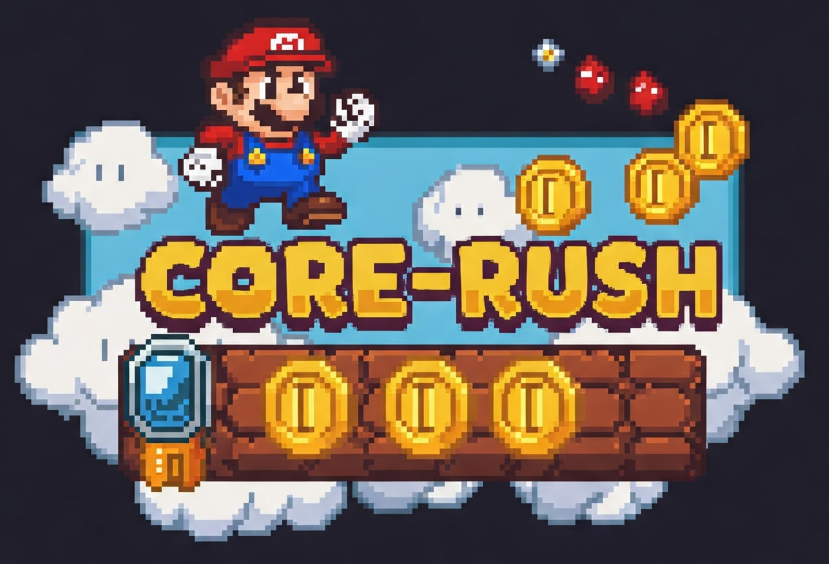

## 🚀 Introduction
Welcome to **CORErush**, an exciting Mario-style game where players can stake their **CORE tokens**, predict their expected score, and win bonuses based on their performance. Test your skills, challenge yourself, and earn rewards by achieving your predicted score!

## 🏗️ Architecture
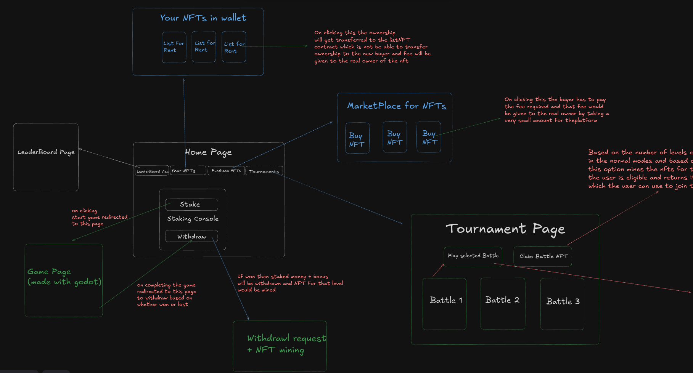
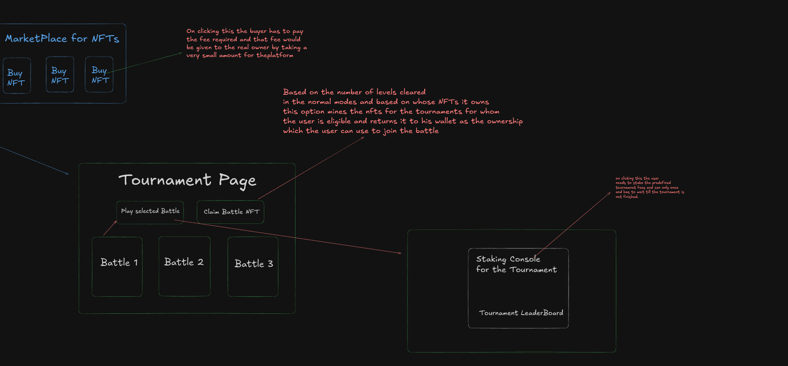

## 🎯 How It Works
1. **Stake CORE Tokens**: Players must stake a certain amount of **CORE tokens** before starting the game.
2. **Set an Expected Score**: Players enter their target score before playing.
3. **Play the Game**: Navigate through levels, overcome obstacles, and score points.
4. **Bonus Calculation**: If the player meets or exceeds their expected score, the algorithm calculates a bonus based on their performance.
5. **Claim Rewards**: Players can claim their winnings if they successfully achieve their target score.

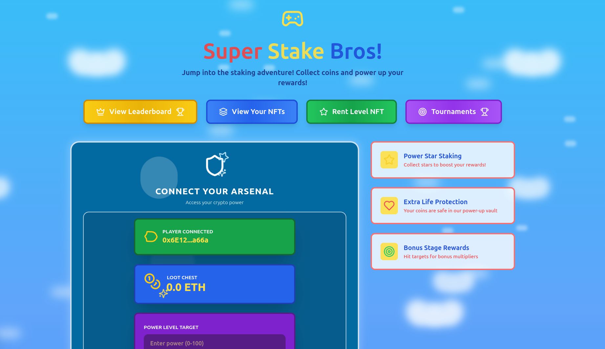

## ✨ Features
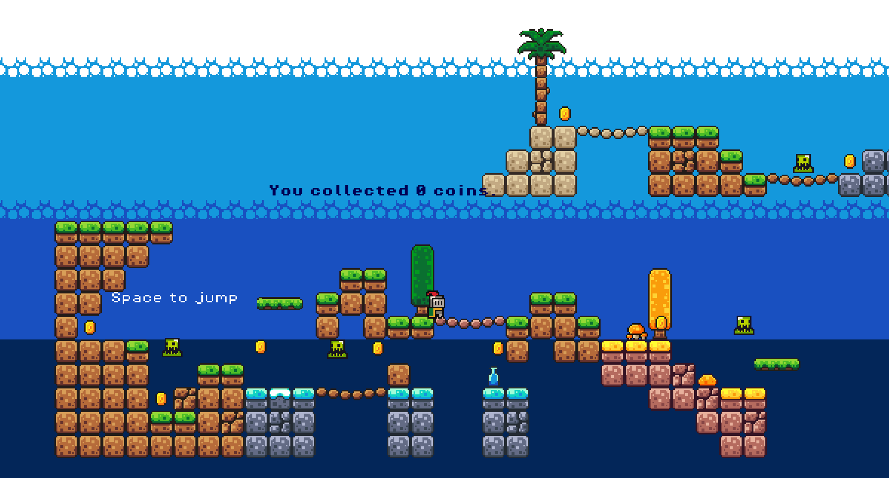

- **Classic Mario-style gameplay** with exciting levels and challenges.
- **Staking mechanism** using CORE tokens for risk-based gaming.
- **Algorithm-driven rewards** based on score predictions.
- **Decentralized & Transparent** system ensuring fair play.
- **Engaging and Competitive** gaming experience.

## 📜 Rules
- Players must **stake tokens** before starting a game session.
- The **expected score must be set** before playing.
- Players **only win bonuses** if they meet or exceed their expected score.
- If the player fails to achieve their expected score, the staked tokens remain in the system.
- Bonuses are dynamically calculated based on risk and performance.

## 🎲 How to Play
1. **Attach Core Chain to MetaMask**  
   - Visit [Chainlist.org](https://chainlist.org) and search for "Core Chain".  
   - Connect your MetaMask wallet and add the network.  

2. **Connect your CORE wallet** to the game.  

3. **Stake your desired amount of CORE tokens**.  

4. **Enter your expected score**.  

5. **Start playing and aim to meet or exceed your target**.  

6. **Claim your rewards if you achieve your goal!**  

## 💰 Bonus Calculation
The bonus is calculated dynamically based on:
- The **difficulty level** of the game.
- The **staked amount** of CORE tokens.
- The **gap between the expected score and the actual score**.
- A **randomized multiplier** to keep gameplay exciting.
  
## 🎁 NFT Rewards  
- On winning, an **NFT is mined for that level** and transferred to your wallet.  
- This NFT serves as proof that you have cleared the level.  
- It can be used for **future endeavors** in the game, unlocking exclusive tournaments.

## 💎 Renting Your Earned NFT  
Once you earn an NFT by clearing a level, you have the option to **list it for rent**:  

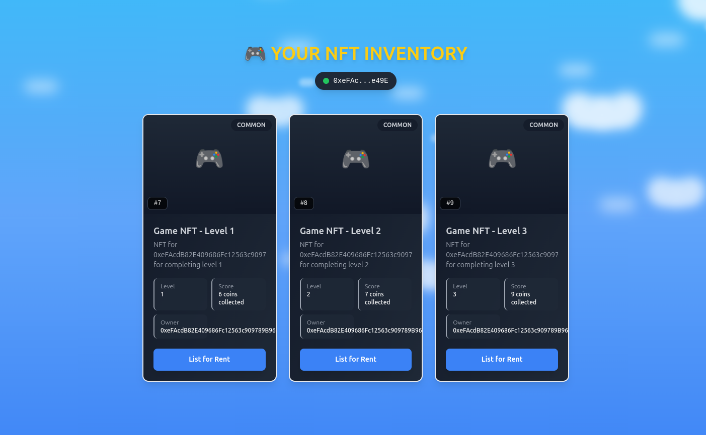

### How to List Your NFT for Rent  
1. Navigate to the **Your NFTs** section in the game.  
2. Select the **NFT** you want to rent out.  
3. Set the **rental price** in CORE tokens.  
4. Confirm the listing, and your NFT will be available for other players to rent.  

### Earning CORE Tokens from Rentals  
- When another player rents your NFT, you **receive CORE tokens** as payment.  
- The NFT will remain in their possession for the rental period.  
- Once the rental expires, the NFT returns to you automatically.  

### Important Rule:  
- **If you rent out your NFT, you will need to clear that level again** before progressing further in the game.  

## 🛒 Game Level Marketplace - Buy NFTs  
Purchase powerful game level NFTs to advance your progress in the game!  

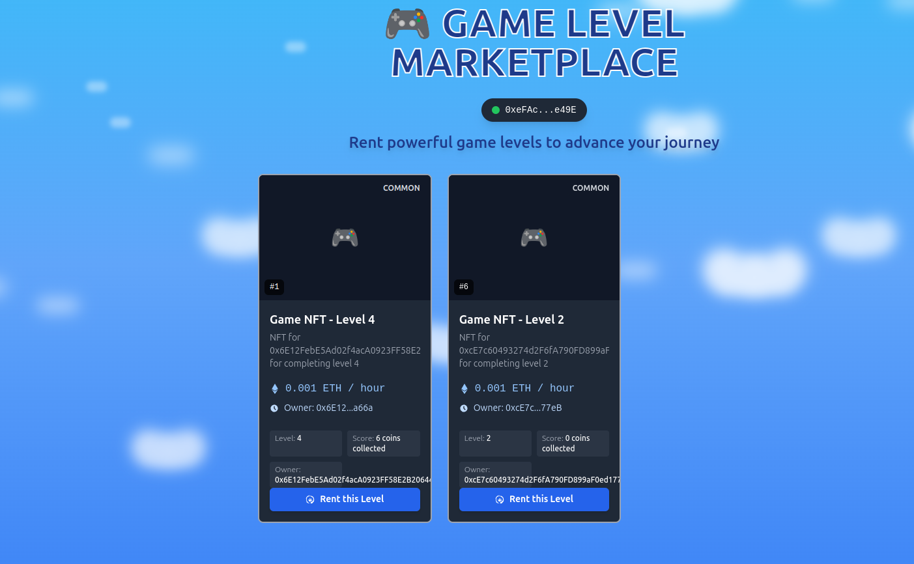

### How to Buy  
1. Browse the available **Game Level NFTs** in the marketplace.  
2. Select an NFT corresponding to the level you want to unlock.  
3. Click on **Buy this NFT** and confirm the transaction.  
4. Once purchased, the NFT will be transferred to your wallet.  
5. You can now use this NFT to skip the cleared level in future attempts.  

### NFT Purchase Details  
- Each **Game Level NFT** represents a completed level.  
- **CORE tokens** are required to buy an NFT.  
- Once an NFT is sold, ownership is transferred to the buyer.  
- If you sell your NFT, you must **clear that level again** to proceed.  

> **Note:** Ensure your CORE wallet is connected before making a purchase.  

---

## 🏆 Game Leaderboard - All-Time Rankings  
Track the top players in the game from the day it launched until today!  

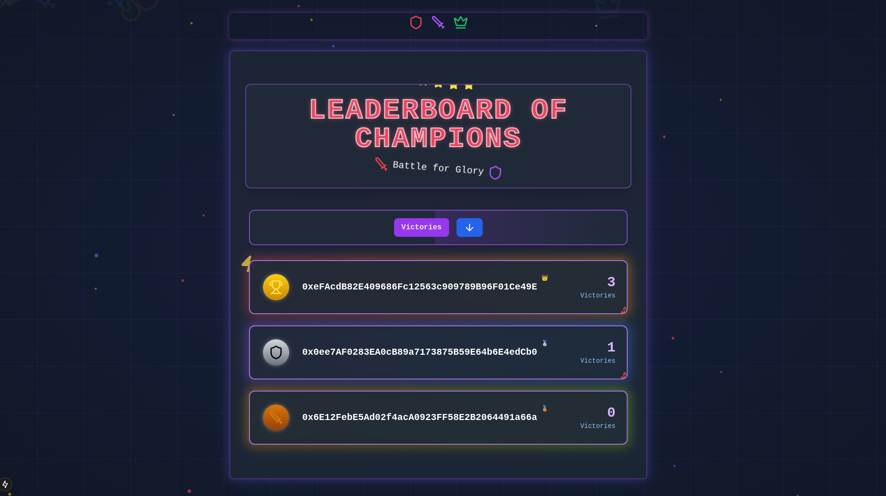

### How the Leaderboard Works  
- Players are ranked based on their **total CORE earnings** and **levels completed**.  
- Higher levels and greater achievements yield more points.  
- The leaderboard updates dynamically as players progress.  

### Top Players - All-Time  
| Rank | Player Wallet | Levels Cleared | CORE Earned | Wins |
|------|--------------|---------------|-------------|------|
| 🥇 1  | 0xA1...9bC3  | 12            | 150 CORE    | 48   |
| 🥈 2  | 0xB2...8fD5  | 11            | 135 CORE    | 42   |
| 🥉 3  | 0xC3...7eA2  | 10            | 120 CORE    | 38   |
| 4    | 0xD4...6cB8  | 9             | 110 CORE    | 34   |
| 5    | 0xE5...5dF1  | 8             | 100 CORE    | 30   |

### How to Climb the Leaderboard  
1. **Play More:** Complete levels to earn CORE rewards and NFTs.  
2. **Stake Wisely:** Higher stakes can lead to greater rewards.  
3. **Win Challenges:** Achieve high scores and surpass expectations.  
4. **Rent or Buy NFTs:** Use game NFTs strategically to unlock levels faster.  

### Rewards for Top Players  
- **Monthly Rewards:** The top 3 players receive additional CORE bonuses.  
- **Exclusive NFTs:** Special NFTs are minted for leaderboard champions.  
- **Hall of Fame:** The highest-ranked players earn permanent recognition in the game.  

> **Stay competitive and rise to the top! 🚀**  

---

# 🏆 Tournament Mode: The Ultimate Challenge

Welcome to **Tournament Mode**, where the best players battle for glory, exclusive rewards, and a massive prize pool! This high-stakes mode is for **elite competitors** who are ready to prove their skills.

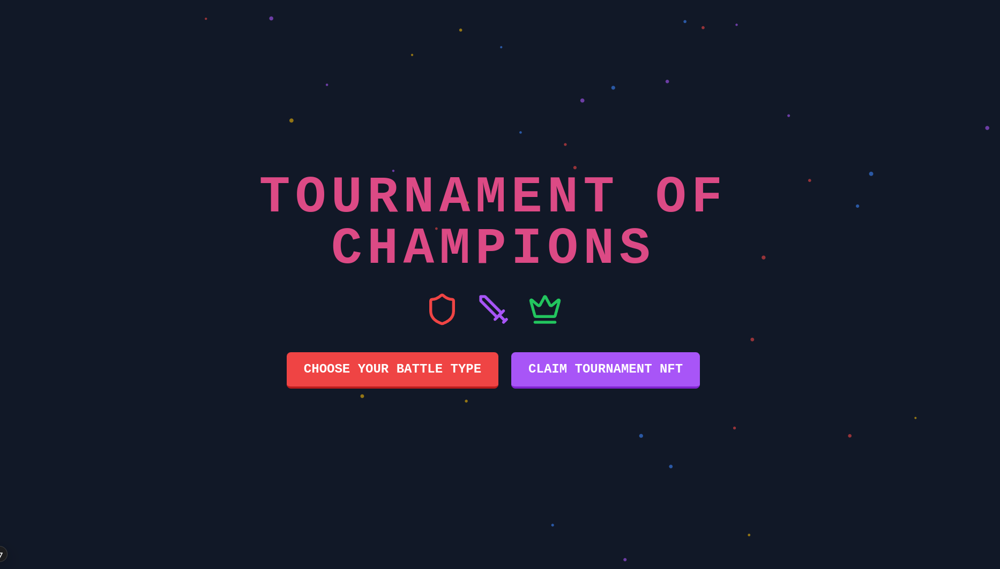

---

# ⚔️ Tournament Types: Choose Your Battlefield!  

Currently, there are **three** thrilling tournament types, each designed for different playstyles.  
**Which one will you dominate?**  

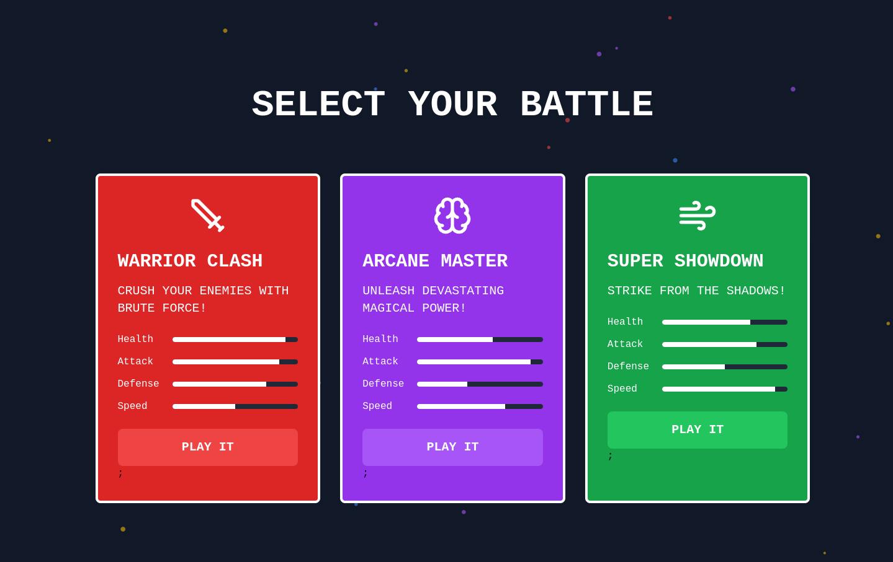

---

## 🛡️ 1. WARRIOR CLASH (For Strength & Endurance)  
**"CRUSH YOUR ENEMIES WITH BRUTE FORCE!"**  

🏟️ **Gameplay:**  
- Face off in **intense one-on-one battles** where strength is key.  
- Survive brutal **last-man-standing** encounters.  
- **Strategy:** Endurance and powerful attacks will decide the victor!  

🎯 **Enter the Arena:** [Join WARRIOR CLASH ➝](/warrior_clash)  

---

## 🔮 2. ARCANE MASTER (For Magic & Strategy)  
**"UNLEASH DEVASTATING MAGICAL POWER!"**  

🏟️ **Gameplay:**  
- Use **high-damage spells** to defeat enemies before they get close.  
- **Outsmart** your opponents with **tactical movement**.  
- **Strategy:** **Fast execution** and **precision timing** will determine the winner!  

🎯 **Master the Arcane:** [Join ARCANE MASTER ➝](/arcane_master)  

---

## 🏹 3. SUPER SHOWDOWN (For Speed & Stealth)  
**"STRIKE FROM THE SHADOWS!"**  

🏟️ **Gameplay:**  
- **Fast-paced combat** where movement and reflexes are everything.  
- **Dodge, strike, and disappear**—hit enemies before they react!  
- **Strategy:** Quick **decision-making and positioning** will lead to victory.  

🎯 **Dominate the Shadows:** [Join SUPER SHOWDOWN ➝](/super_showdown)  

---

## 🏆 Which Tournament Will You Conquer?  
Each tournament requires **different skills and strategies**.  
Choose **your path**, claim **your NFT entry**, and **stake your tokens** for victory!  

## 🎟️ Entry Requirements: Exclusive NFTs  
Participation in a tournament is **not free**—it requires a **special NFT**.  

### How do you get these NFTs?  
- Players **earn tournament NFTs** based on their **progress** in **Normal Mode**.  
- Different tournaments require **different NFTs**, ensuring **balanced** competition.  
- Some tournaments may have **unique NFTs** that can be **minted during special events**.  

---

## 💰 Staking Mechanism: Show Your Commitment  
- Each tournament has its **own token** that players must **stake** to enter.  
- The total **staked amount** forms the **prize pool** for the tournament.  
- Staking **adds strategic depth**—only **serious** players join the battle!  

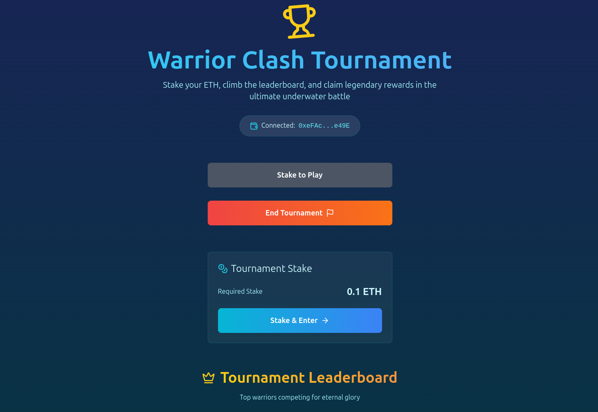

---

## 📊 Tournament Format: Compete & Climb the Leaderboard  
- Players can **participate in an ongoing tournament** **only once** per event.  
- Their **performance** is recorded on the **Tournament Leaderboard**.  
- The leaderboard ranks players based on **wins, scores, or other game-specific metrics**.  
- Unlike normal mode, **every decision counts**—there are **no second chances**!  

---

## 🎯 The Role of the Tournament Owner  
- Each tournament has an **owner** who can **end the tournament** when it reaches its natural conclusion.  
- Once a tournament is finished, the **final leaderboard rankings** determine the winners.  

---

## 🏅 Prize Pool Distribution  
- At the end of the tournament, the **prize pool** is **distributed among top players**.  
- The higher your **ranking**, the **larger your share** of the pool.  
- Some tournaments may offer **additional rewards**, such as **rare NFTs** or **special game perks**.  

### Example Prize Distribution (for a 100-token prize pool):
1. 🥇 **1st Place** - 50% (50 tokens)  
2. 🥈 **2nd Place** - 30% (30 tokens)  
3. 🥉 **3rd Place** - 15% (15 tokens)  
4. 🎖️ **4th-10th Place** - 5% split equally  

---

## 🔥 Why Should You Join Tournament Mode?  
### ✨ **High-Stakes Action**  
Unlike normal mode, **every move matters**—only the strongest survive.  

### 💎 **Win Exclusive Rewards**  
Tournaments give **bigger rewards** and **special items** that **normal mode doesn't offer**.  

### 👑 **Prestige & Recognition**  
Top players **cement their legacy** in the game's history.  

### 🌟 **Limited-Edition Tournaments**  
Some events **only happen once**, making them **highly competitive** and **legendary**.  

---

## 🚀 Are You Ready to Take the Challenge?  
Gather your **skills**, secure your **NFT entry pass**, and **stake your way** into battle.  
Only the **best** will rise to the top—**will you be one of them?**  

---

# 🛠️ Tech Stack Behind CORE RUSH  

Building **CORE RUSH** required a powerful and efficient stack to ensure a seamless **Web3 gaming experience**. Here's what's under the hood:  

---

## 🌐 Frontend: **Next.js**  
- **Framework:** Next.js (React-based)  
- **Why?** Fast, optimized, and perfect for **Web3 interactions**  
- **Features:** Server-side rendering (SSR) & static site generation (SSG) for performance  

---

## 🖥️ Backend: **Node.js & Express**  
- **Why?** Scalable, efficient, and lightweight for handling API requests  
- **Role:** Manages **authentication**, **game logic**, and **data processing**  

---

## 🗄️ Database: **MongoDB**  
- **Why?** NoSQL, scalable, and great for handling **dynamic game data**  
- **Usage:** Stores **user data**, **tournament details**, and **NFT claims**  

---

## 📦 NFT Storage: **Pinata IPFS**  
- **Why?** Decentralized, immutable, and **ideal for storing NFT metadata**  
- **Usage:** Stores **tournament-specific NFTs**, ensuring accessibility on-chain  

---

## 💳 Wallet Integration: **MetaMask**  
- **Why?** Secure and widely adopted Web3 wallet  
- **Usage:** Players use MetaMask for **staking tokens**, **claiming rewards**, and **joining tournaments**  

---

## ⛓️ Blockchain Network: **Core Testnet (ChainID: 1114)**  
- **Why?** A **test environment** before launching on mainnet  
- **Usage:** All **smart contracts** are deployed here for testing & gameplay  

---

## 🔗 Smart Contracts: **Solidity**  
- **Why?** The industry standard for **secure and efficient** smart contract development  
- **Usage:**  
  - **Manages tournament entries & stakes**  
  - **Handles NFT minting & claiming**  
  - **Controls reward distribution based on leaderboard rankings**  

---

## 🚀 Join the Gaming Revolution!
This **tech stack** ensures **smooth gameplay, secure transactions, and an immersive experience** for all players!  
Stay tuned as we **expand to mainnet and introduce more features**!